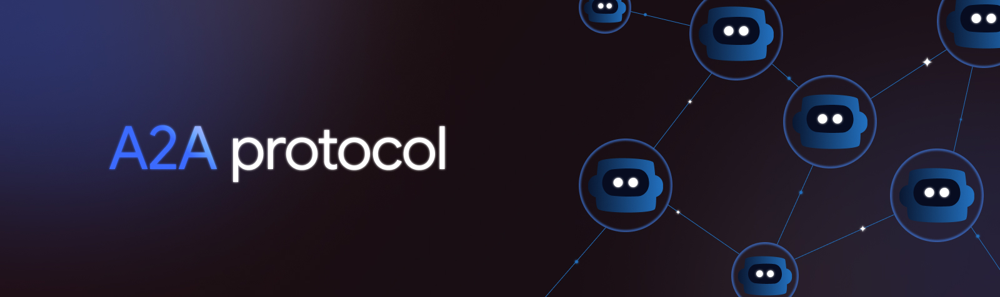
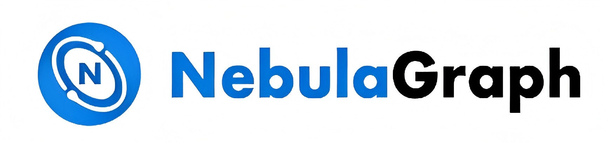

  <h1> Welcome traveler, This is my Tech Community Heaven</h1>

My name is **Hang**, but I go mostly by **Justin**. I am a passionate **AI engineer**,  with a strong focus on **microservices architecture**,  
**cloud-native architecture**, and **databases**. These are also the topics of my past Master's research.  

Feel free to send me a message to [zhangxing11@aliyun.com](mailto:zhangxing11@aliyun.com)  
I respond within an hour, unless I'm asleep or distracted by code or a game.

---

  <h1>The Tools I Love</h1>

  

  
   
  
  

  
  
  
  

 

 
   
  
  
  

